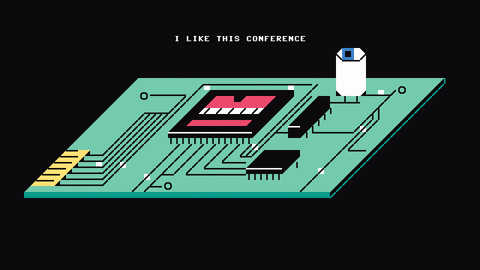

<h1 align="center"> 你好! Hello! おす! Bonjour! здравствй! 👋 
This is Showhandss! </h1>

    

- 🔭 Doing researches on BIZ data science📊.
- 🌱 Working on Artificial intelligence🤖, Blockchian📦🔗, Web3️⃣ and Quantum Machine⚛️.
- 🚀 Highly regarded AIGC! My research assistant is **ChatGPT**🤖💬. I also use Bard, Wenxinyiyan, NotionAI, DeepAI to change life.
- 🔨 Own projects in Python, R, Javascript, C#, React, Vue, SQL, C.
- 😄 Pronouns: 🧙‍♂️**He/Him**
- 😍 Hobby: Travel🗺(Once around the earth in 22 days), Photography📷, Excercise💪🏽, Entertainment🎰.
- 🎯 Recent Goal: **Find a JOB**, you can reach me: [showhandss@gmail.com](showhandss@gmail.com)

<h3 align="center">☀️ Preferred OS</h3>

 
 
 
 

<h3 align="center">🗪 Languages</h3>

 

<h3 align="center">🔗 BlockChain & 🔑 CryptoCurrency & 🌐 Web 3</h3>

 

 
 

<h3 align="center">📑 Web Development</h3>

 
 
 
 
 

<h3 align="center">💾 Databases</h3>

    

<h3 align="center">🎨 Design</h3>

 

 

<h3 align="center">💻 Workspace</h3>

 
 
 

 
 
 
 

    

## My Github Stats 📊 

   
    
  
   
  

 
 

    

<!-- ### Views and Followers

 -->
